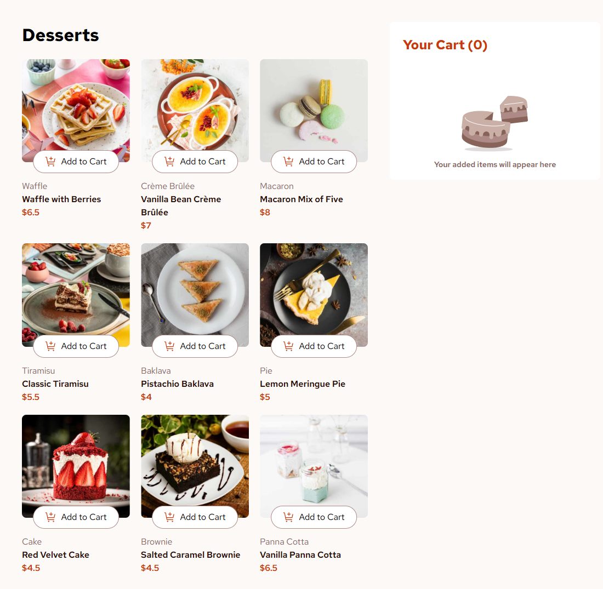

# Product List with Cart

A responsive product list project featuring a functional cart that allows users to add, remove, and adjust item quantities, view an order confirmation modal, and reset their selections.

## Table of Contents

- [Overview](#overview)
- [Features](#features)
- [Built With](#built-with)
- [Live Demo](#live-demo)
- [Repository](#repository)
- [Screenshots](#screenshots)
- [Connect with Me](#connect-with-me)
- [What I Learned](#what-i-learned)
- [Feedback](#feedback)

## Overview

- Responsive product list interface with dynamic data from a local JSON file.
- Functional cart with add, remove, and quantity control features.
- Order confirmation modal that appears on "Confirm Order".
- "Start New Order" resets selections.
- Optimized layout for both mobile and desktop screens.

## Features

- Add items to the cart.
- Remove items from the cart.
- Increase/decrease item quantities.
- Display order confirmation modal.
- Reset orders with a single click.
- Responsive design with interactive hover and focus states.

## Built With

- **HTML**
- **Tailwind CSS** (via CDN)
- **JavaScript**
  - Async/Await for fetching data.
  - **DocumentFragment** for efficient DOM manipulation.
  - **Event Delegation** for handling events on dynamic content.

## Live Demo

[View Live Demo](https://okasha07.github.io/product-list-with-cart/)

## Repository

[GitHub Repository](https://github.com/okasha07/product-list-with-cart)

## Screenshots

### 📱 Mobile View  

### 💻 Desktop View  

## Connect with Me

- **GitHub:** [okasha07](https://github.com/okasha07)
- **LinkedIn:** [okasha07](https://www.linkedin.com/in/okasha07)
- **Twitter (X):** [mokasha07](https://twitter.com/mokasha07)
- **Frontend Mentor:** [okasha07](https://www.frontendmentor.io/profile/okasha07)
- **LeetCode:** [okasha07](https://leetcode.com/okasha07)
- **Qabilah:** [okasha07](https://qabilah.com/profile/okasha07/)
- **Facebook:** [okasha07](https://www.facebook.com/okasha07)

## What I Learned

- Efficient DOM updates using **DocumentFragment**.
- Handling dynamic events with **Event Delegation**.
- Traversing the DOM using the **closest()** method.
- Implementing responsive images with **srcset** and **sizes**.
- Rapid UI development with **Tailwind CSS**.
- Lazy loading images for improved performance.

## Feedback

If you have any feedback, please feel free to reach out.
